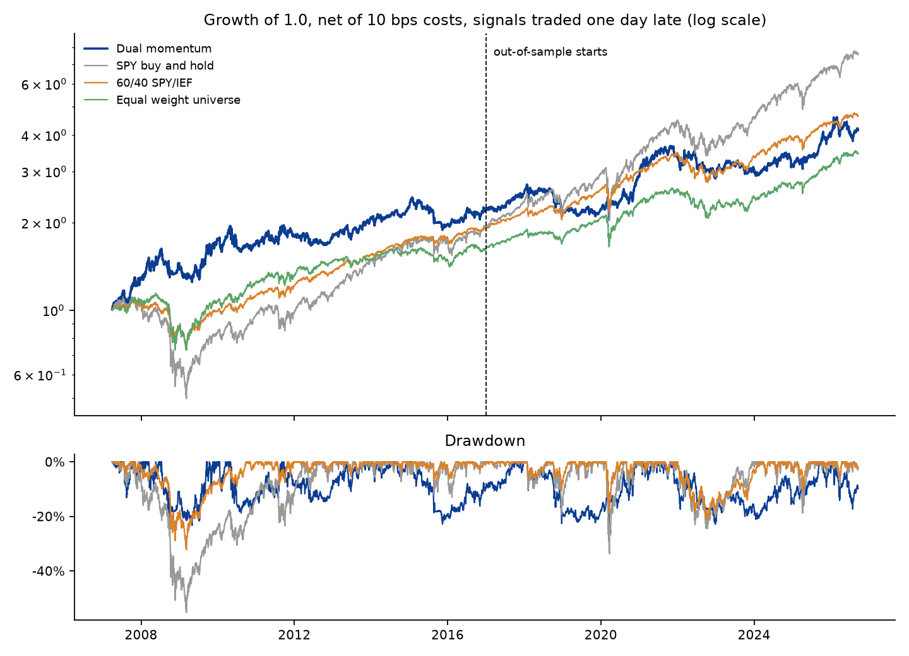
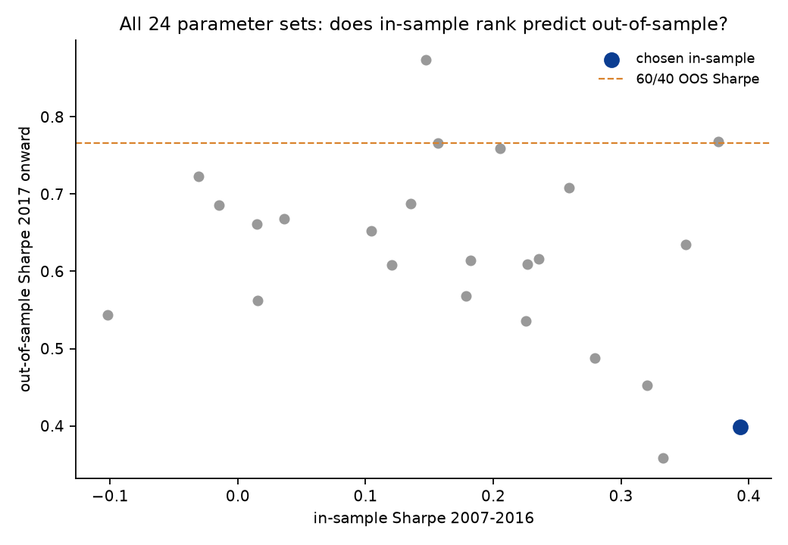
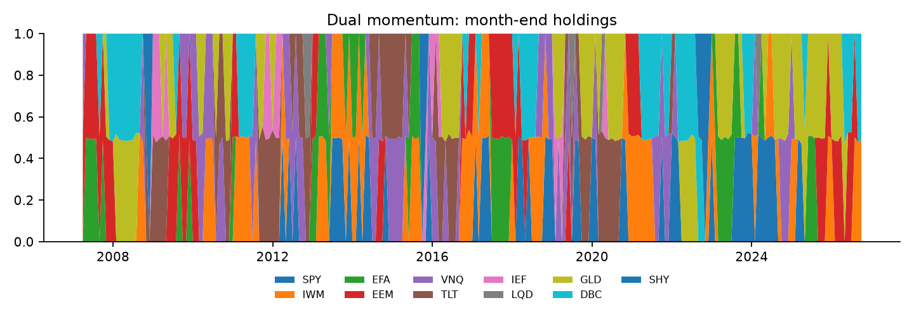

# Momentum backtester

A small portfolio backtesting engine in Python with a test suite, used to run a walk-forward test of dual momentum across asset-class ETFs.

I built it to answer one question properly: does a textbook momentum rotation still beat a plain 60/40 portfolio once you trade a day late, pay costs, and stop choosing parameters with hindsight?

Short answer from the data: no. Details below.

## What the engine does

- Signals use prices up to the close of day t. The trade happens at the close of day t+1. New weights earn from day t+2. The lag is a parameter and there is a test that proves a price jump between signal and execution is not captured.
- Weights drift between rebalances. They are not silently reset each day.
- Costs are charged on traded notional. A full switch from one asset to another is turnover of 2.0, so 10 bps costs 20 bps of equity.
- Unallocated weight sits in cash at zero. Long only, no leverage, and the engine rejects inputs that break that.
- Prices are cached to `data/prices.csv`, so every number here can be reproduced from the same file.

## Tests

`pytest` runs 19 tests in under a second. The ones that matter most:

| Test | What it proves |
| --- | --- |
| `test_no_lookahead_future_prices_do_not_change_the_past` | Multiply all prices after day 60 by 3.7. Equity before day 60 is identical. |
| `test_signals_do_not_use_future_data` | Signals from truncated data equal signals from the full data on the same dates. |
| `test_lag_means_jump_before_execution_is_not_captured` | With lag 1 a 50 percent jump on the execution day is missed. With lag 0 it is caught. |
| `test_cost_of_full_switch_is_two_sided` | Flat prices, two trades, final equity equals (1 - 0.001)(1 - 0.002) exactly. |
| `test_weights_drift_between_rebalances` | A 50/50 portfolio where one asset doubles ends at 2/3 and 1/3. |
| `test_buy_and_hold_matches_price_ratio` | Engine equity equals the raw price ratio to 1e-12. |

As an outside check, SPY buy and hold through the engine gives 15.3 percent a year out of sample. The same figure computed straight from the price file is 15.2 percent.

## The experiment

- Universe: SPY, IWM, EFA, EEM, VNQ, TLT, IEF, LQD, GLD, DBC, with SHY as cash. Asset-class ETFs avoid the survivorship bias you get from backtesting on today's index members.
- Data: Yahoo Finance adjusted closes, 6 Feb 2006 to 18 Sep 2026, 5,187 trading days, common history only, no forward fill.
- Strategy: at each month end rank by past return, hold the top N equally weighted, and move any slot to cash if that asset has not beaten cash over the same window.
- In sample, June 2007 to Dec 2016: 24 parameter sets (lookback 3, 6, 9, 12 months; skip 0 or 1 month; top 2, 3 or 4). Best Sharpe wins.
- Out of sample, Jan 2017 to Sep 2026: parameters frozen, run once.
- 10 bps per unit traded, one day execution lag, Sharpe measured over SHY.

## Results

Chosen in sample: 6 month lookback, no skip, top 2.

| Out of sample, 2017 to Sep 2026 | CAGR | Vol | Sharpe | Max drawdown | Turnover a year |
| --- | --- | --- | --- | --- | --- |
| Dual momentum (frozen parameters) | 6.7% | 15.1% | 0.40 | -24.4% | 8.3x |
| 60/40 SPY/IEF | 9.7% | 10.7% | 0.77 | -21.2% | 0.2x |
| SPY buy and hold | 15.3% | 18.1% | 0.77 | -33.7% | 0 |
| Equal weight universe | 8.1% | 10.6% | 0.65 | -22.2% | 0.3x |

| In sample, Jun 2007 to 2016 | CAGR | Vol | Sharpe | Max drawdown |
| --- | --- | --- | --- | --- |
| Dual momentum | 7.7% | 17.9% | 0.39 | -23.3% |
| 60/40 SPY/IEF | 6.5% | 11.4% | 0.43 | -32.2% |
| SPY buy and hold | 6.3% | 21.2% | 0.29 | -55.2% |

What I take from it:

1. The strategy did its job in 2008. It held the drawdown to 23 percent when SPY lost 55 percent. That is the whole in-sample case for it.
2. Out of sample it lost to 60/40 on return, Sharpe and drawdown. The bootstrapped Sharpe gap is -0.37 with a 95 percent interval of -1.08 to +0.26, so the honest statement is "no evidence it is better", not "proven worse".
3. Picking parameters in sample did not help. The winning set ranked 23rd of 24 out of sample, and the rank correlation between in-sample and out-of-sample Sharpe across the grid is -0.27. The best out-of-sample set (9 month lookback, skip 1, top 3, Sharpe 0.87) was one of the worst in sample. Reporting that set would be data mining, so I don't.
4. Costs matter at this turnover. On the frozen parameters, out-of-sample Sharpe goes from 0.45 at zero cost to 0.18 at 50 bps.





## Limits

- Yahoo adjusted closes, not a point-in-time database. Dividends are reinvested at the close with no tax.
- Trades fill at the closing price. No market impact model, which is fine for these ETFs at small size and wrong at large size.
- One out-of-sample path of under ten years. It was a period where US equities beat almost everything, which hurts any diversifying rotation.
- Cash earns zero unless the strategy holds SHY.

## Run it

```
pip install -r requirements.txt
pytest -q
python run_backtest.py
```

Outputs land in `results/`: `results.json`, `grid.csv`, `cost_lag_sensitivity.csv` and three charts.

Derezar Master, September 2026. Not investment advice.
